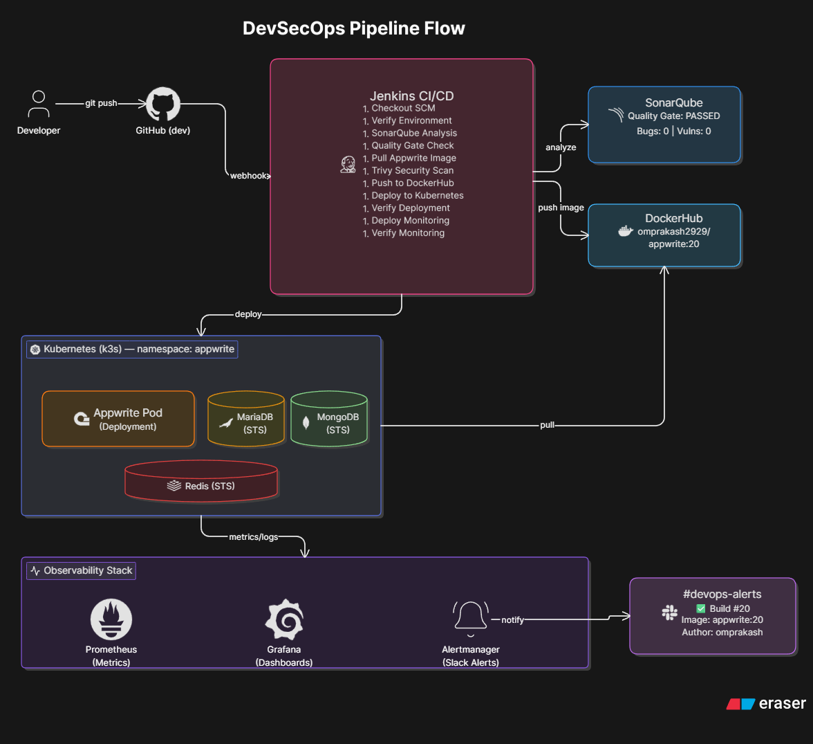
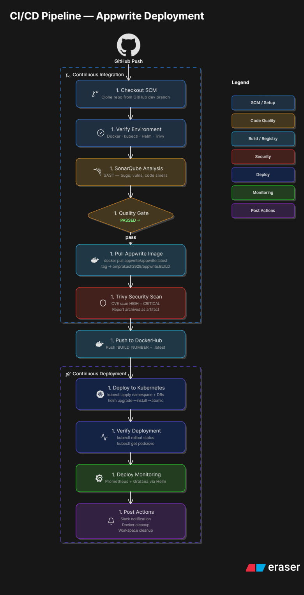
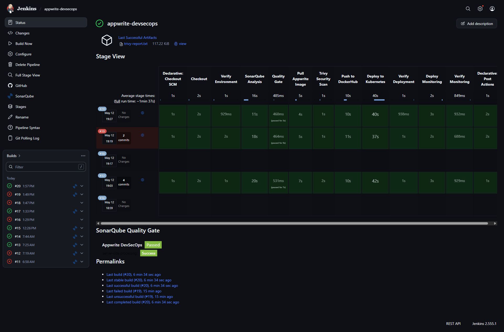
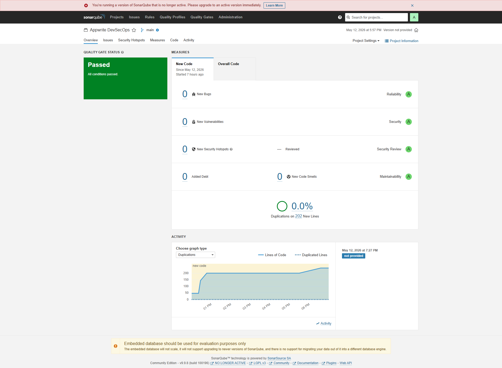
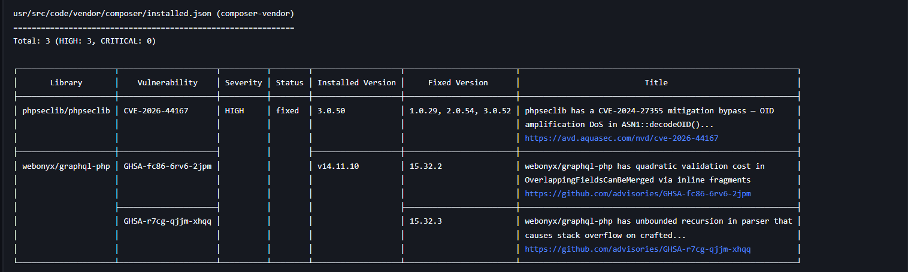
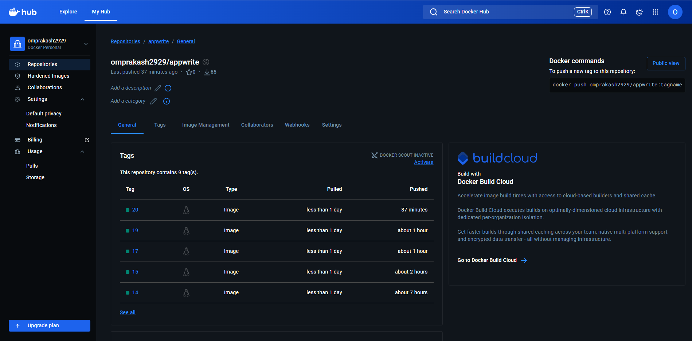
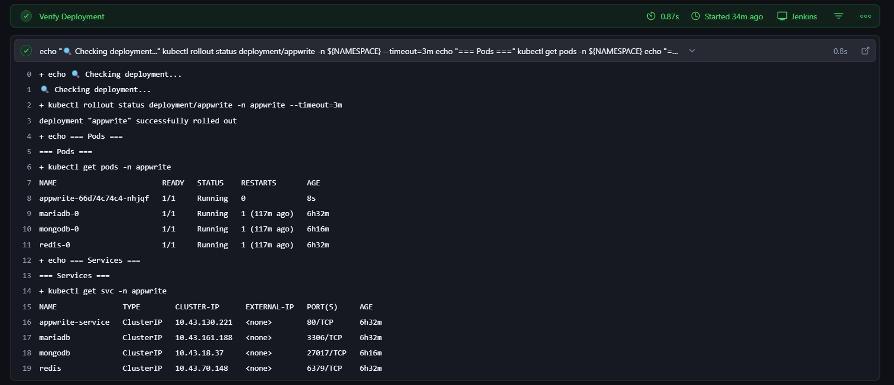
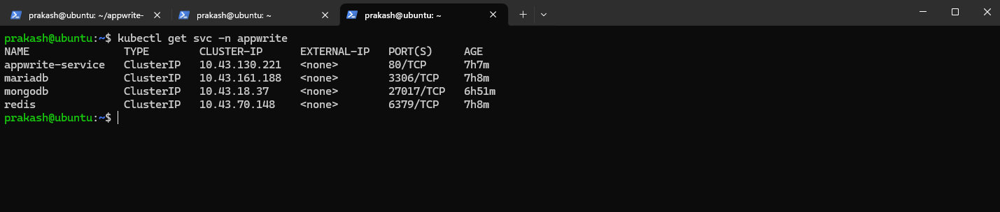
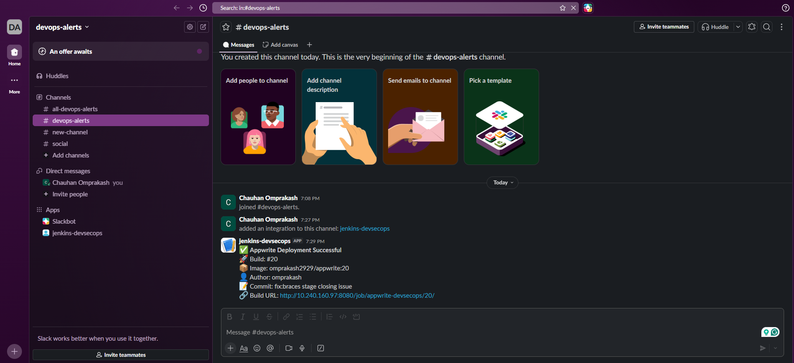
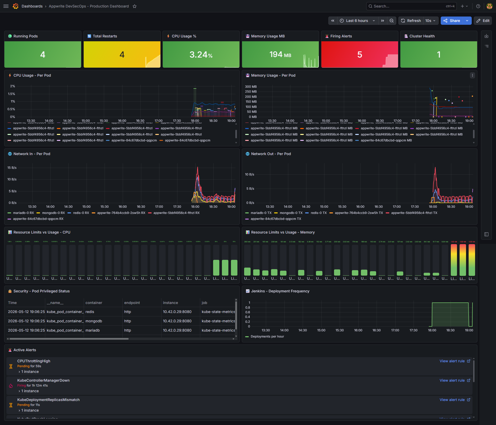

# 🚀 Appwrite DevSecOps Pipeline

### Production-Grade CI/CD with Security Scanning, Kubernetes Deployment & Full Observability
[](http://jenkins)
[](http://sonarqube)
[](https://hub.docker.com/r/omprakash2929/appwrite)
[](https://k3s.io)
[](https://helm.sh)
[](https://trivy.dev)
[](https://prometheus.io)
[](https://grafana.com)
[](https://slack.com)

**[📋 Project Docs](#-project-overview) • [🏗️ Architecture](#-architecture) • [⚙️ Pipeline](#-cicd-pipeline) • [📊 Monitoring](#-monitoring--observability) • [🚀 Setup](#-quick-start)**


---

## 📋 Project Overview

This project demonstrates a **production-grade DevSecOps CI/CD pipeline** for [Appwrite](https://appwrite.io) — an open-source Firebase alternative with **54k+ GitHub stars**. The pipeline automates the entire software delivery lifecycle from code commit to production deployment with integrated security scanning, container orchestration, and full-stack observability.

> **Why Appwrite?** Appwrite is a real-world, enterprise-grade platform used by thousands of developers globally. Deploying it with a full DevSecOps pipeline demonstrates the ability to handle complex, multi-service architectures — exactly what companies like IBM, HCL, and Visa use in production.

### 🎯 Key Highlights

| Feature | Details |
|---|---|
| **CI/CD Tool** | Jenkins with 11 automated pipeline stages |
| **Security** | SonarQube SAST + Trivy CVE scanning (image + filesystem) |
| **Registry** | DockerHub — 20+ versioned image tags |
| **Orchestration** | Kubernetes (k3s) with Helm charts |
| **Observability** | Prometheus + Grafana + Alertmanager |
| **Notifications** | Real-time Slack alerts on every deployment |
| **Pipeline Time** | ~1 min 37 sec end-to-end |

---

## 🏗️ Architecture



---

## ⚙️ CI/CD Pipeline

### Pipeline Stages



### 📸 Pipeline Screenshots

> **Jenkins Stage View — Build #20 (All Green ✅)**



> **SonarQube Quality Gate — PASSED**



> **Trivy Security Report — 3 HIGH CVEs detected**



> **DockerHub — 9 image tags published**



> **Verify Deployment — All Pods Running ✅**


> **Kubernetes Services**


> **Slack Alert — Deployment notification**



---

## 📊 Monitoring & Observability

### Grafana Production Dashboard

> **Live metrics across all 4 pods — Appwrite, MariaDB, MongoDB, Redis**



### Dashboard Panels

| Panel | Metric | Description |
|---|---|---|
| **Running Pods** | `4` | Total healthy pods |
| **Total Restarts** | `4` | Pod restart count |
| **CPU Usage %** | `3.24%` | Cluster CPU utilization |
| **Memory Usage** | `194 MB` | Total memory used |
| **Firing Alerts** | `5` | Active Alertmanager alerts |
| **Cluster Health** | `1` | Healthy nodes |
| **CPU per Pod** | Time series | Per-pod CPU over time |
| **Memory per Pod** | Time series | Per-pod memory over time |
| **Network I/O** | Time series | Network in/out per pod |
| **Security Panel** | Table | Pod privileged status |
| **Deployment Frequency** | Graph | Jenkins deployments/hour |
| **Active Alerts** | List | CPUThrottling, ControllerDown |

### Alert Rules

```yaml
- CPUThrottlingHigh      # CPU throttle > threshold
- KubeControllerManagerDown  # Controller manager health
- KubeDeploymentReplicasMismatch  # Replica count mismatch
- PodCrashLoopBackOff    # Pod restart loop
- HighMemoryUsage        # Memory > 85%
```

---

## 🛠️ Tech Stack

| Category | Tool | Version | Purpose |
|---|---|---|---|
| **Source Control** | GitHub | - | Code hosting + webhook triggers |
| **CI/CD** | Jenkins | 2.555.1 | Pipeline automation |
| **Code Quality** | SonarQube | 9.9.8 | SAST + quality gate |
| **Security Scan** | Trivy | 0.70.0 | CVE + secret scanning |
| **Containerization** | Docker | 29.4.1 | Image build + registry |
| **Registry** | DockerHub | - | Image storage (20+ tags) |
| **Orchestration** | Kubernetes (k3s) | v1.36.0 | Container orchestration |
| **Package Manager** | Helm | v3.20.2 | K8s application packaging |
| **Database** | MariaDB | 10.11 | Relational database |
| **Cache/Queue** | Redis | 7.2 | Cache + message queue |
| **Document DB** | MongoDB | 5.0 | Document store |
| **Metrics** | Prometheus | - | Metrics collection |
| **Dashboards** | Grafana | - | Visualization |
| **Alerting** | Alertmanager | - | Alert routing |
| **Notifications** | Slack | - | Deployment alerts |
| **IaC** | Helm Charts | - | Declarative K8s config |

---

## 📁 Repository Structure

```
appwrite-devsecops/
│
├── 📄 Jenkinsfile                    # 11-stage CI/CD pipeline
├── 📄 sonar-project.properties       # SonarQube configuration
├── 📄 .gitignore                     # Secrets excluded
│
├── 📁 helm/
│   └── 📁 appwrite/
│       ├── 📄 Chart.yaml             # Helm chart metadata
│       ├── 📄 values.yaml            # Image tag + config
│       └── 📁 templates/
│           ├── 📄 deployment.yaml    # Appwrite Deployment
│           ├── 📄 service.yaml       # ClusterIP/NodePort
│           └── 📄 ingress.yaml       # Ingress rules
│
├── 📁 k8s/
│   ├── 📄 namespace.yaml             # appwrite namespace
│   ├── 📄 mariadb.yaml               # MariaDB StatefulSet
│   ├── 📄 mongodb.yaml               # MongoDB StatefulSet
│   └── 📄 redis.yaml                 # Redis StatefulSet
│
└── 📁 monitoring/
    ├── 📄 servicemonitor.yaml        # Prometheus ServiceMonitor
    └── 📄 alert-rules.yaml           # Custom alert rules (CPU, Memory, Pod crash)  
    └── 📄 prometheus-values.yaml     # Prometheus Helm chart override values 
    └── 📄 grafana-dashboard.json     # Custom Grafana dashboard (import-ready JSON)     
```

---

## 🚀 Quick Start

### Prerequisites

```bash
# Required tools
docker --version    # Docker 29.x+
kubectl version     # v1.36.x+
helm version        # v3.20.x+
trivy --version     # 0.70.x+
```

### 1. Clone Repository

```bash
git clone https://github.com/omprakash2929/appwrite-devsecops
cd appwrite-devsecops
git checkout dev
```

### 2. Setup k3s Kubernetes

```bash
# Install k3s
curl -sfL https://get.k3s.io | sh -

# Setup kubeconfig
mkdir -p ~/.kube
sudo cp /etc/rancher/k3s/k3s.yaml ~/.kube/config
sudo chown $USER:$USER ~/.kube/config

# Verify
kubectl get nodes
```

### 3. Setup Jenkins

```bash
# Install Jenkins
sudo apt install openjdk-17-jdk jenkins -y
sudo systemctl start jenkins

# Install Docker for Jenkins
sudo apt install docker.io -y
sudo usermod -aG docker jenkins
sudo systemctl restart jenkins
```

### 4. Configure Jenkins

```
Required Plugins:
✅ Docker Pipeline
✅ SonarQube Scanner
✅ Kubernetes CLI
✅ Slack Notification

Required Credentials:
✅ dockerhub-creds  (Username + Password/PAT)
✅ SonarQube-Token  (Secret Text)
✅ github-token     (Secret Text)
```

### 5. Create Pipeline Job

```
New Item → Pipeline → appwrite-devsecops
Definition: Pipeline script from SCM
SCM: Git
URL: https://github.com/omprakash2929/appwrite-devsecops
Branch: */dev
Script Path: Jenkinsfile
```

### 6. Deploy Monitoring

```bash
# Add Helm repos
helm repo add prometheus-community \
  https://prometheus-community.github.io/helm-charts
helm repo update

# Install monitoring stack
kubectl create namespace monitoring
helm install monitoring \
  prometheus-community/kube-prometheus-stack \
  --namespace monitoring \
  --set grafana.adminPassword=admin123

# Access Grafana
kubectl port-forward svc/monitoring-grafana \
  3000:80 -n monitoring
# Open: http://localhost:3000 (admin/admin123)
```

---

## 📈 Results & Metrics

| Metric | Value |
|---|---|
| **Total Builds** | 20+ builds |
| **Successful Builds** | Build #20 ✅ |
| **Pipeline Duration** | ~1 min 37 sec |
| **Docker Image Size** | 536 MB |
| **DockerHub Pulls** | 65+ |
| **CVEs Detected** | 3 HIGH (reported) |
| **SonarQube Score** | A (all categories) |
| **Quality Gate** | PASSED ✅ |
| **K8s Pods Running** | 4/4 |
| **Grafana Dashboards** | Production-grade |

---

## 🎓 What I Learned

- Designing and implementing multi-stage Jenkins pipelines with parallel execution
- Integrating SonarQube for static analysis and quality gates in CI/CD
- Container vulnerability scanning with Trivy — understanding CVE severity levels
- Kubernetes resource management — Deployments, StatefulSets, Services, PVCs
- Helm chart development for parameterized, reusable Kubernetes deployments
- Setting up full observability with Prometheus ServiceMonitors and Grafana dashboards
- Configuring Alertmanager rules and Slack webhook integrations
- Debugging real production issues — CrashLoopBackOff, MongoDB connection pools, kubeconfig authentication
- k3s single-node cluster setup as a cost-effective production-like environment

---

## 🔮 Future Improvements

- [ ] Fix Appwrite pod stability — complete all required MongoDB connection pools
- [ ] Add OWASP Dependency Check stage to pipeline
- [ ] Implement multi-node k3s cluster for HA
- [ ] Add Loki + Promtail for centralized log aggregation
- [ ] Integrate Jaeger for distributed tracing
- [ ] Add automated rollback on deployment failure
- [ ] Implement GitFlow with PR-based deployments
- [ ] Add network policies for pod-to-pod security

---

## 👨‍💻 Author

**Omprakash Chauhan**

[](https://linkedin.com/in/omprakash-chauhan-07b1b3233)
[](https://github.com/omprakash2929)
[](https://omprakashchauhan.tech)
[](https://hub.docker.com/r/omprakash2929/appwrite)

---

<div align="center">

**⭐ Star this repo if you found it helpful!**

*Built with ❤️ as a portfolio DevSecOps project*

</div>
## Badges

Add badges from somewhere like: [shields.io](https://shields.io/)
[](http://jenkins)
[](http://sonarqube)
[](https://hub.docker.com/r/omprakash2929/appwrite)
[](https://k3s.io)
[](https://helm.sh)
[](https://trivy.dev)
[](https://prometheus.io)
[](https://grafana.com)
[](https://slack.com)

